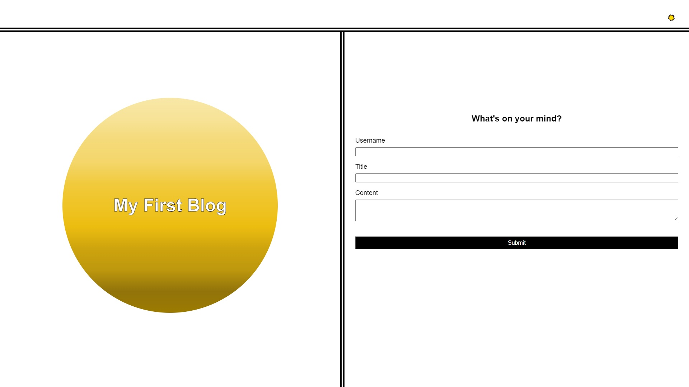
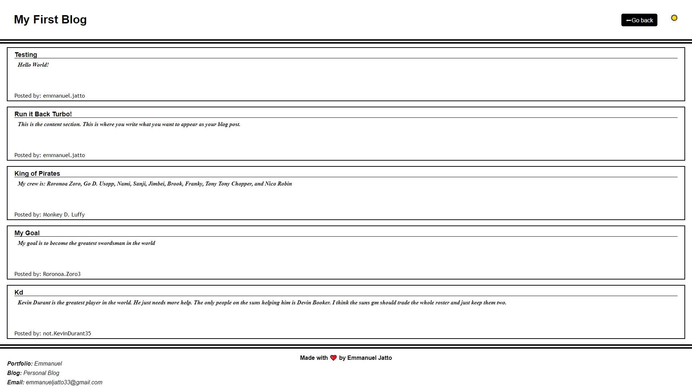
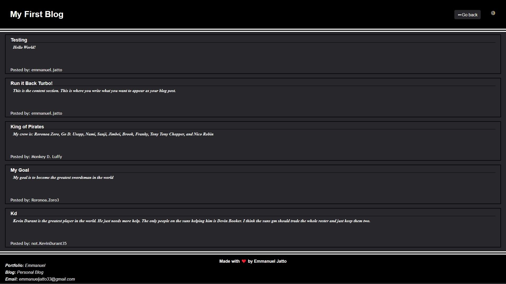

# personal-blog
The goal of this project was to build a blog page from scratch, that could accept user input in a form format.  The page also needed to be able to take the user input store it in local storage as a string, and parse the string back into an object so it can be used by the webpage once again.  

This application is a website of a blog page. 

There were a lot of challenges I faced, when developing this website.  One of the challenges that I faced was formatting a light and dark mode that worked completely.  While there probably was an easier way of formatting this, I put multiple for loops in the eventListener for the light/dark mode button, that targeted each part of the page I wanted to reformat.  I also had to create 2 other function thats would allow me to target the document body as a whole, and I used these 2 functions as well.  

[My First Blog Website Link]()
